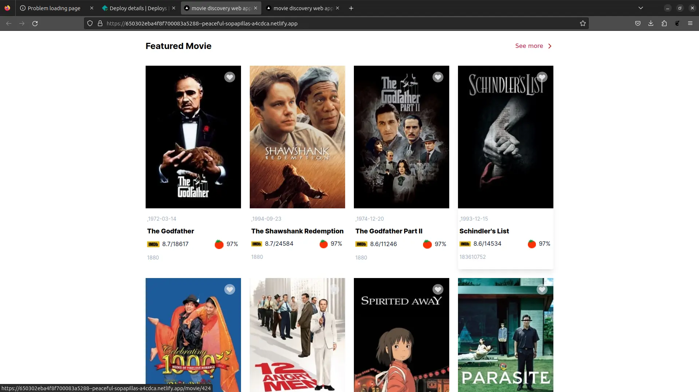

```bash
npm run dev
# or
yarn dev
# or
pnpm dev
```

Open [http://localhost:3000](http://localhost:3000) with your browser to see the result.

STAGE 2 TASKObjective
Create a movie discovery web application that allows users to search for movies, view details about them, and save their favorite movies. You’ll be consuming data from the TMDB API.Requirements1. User Interface:

    Create a responsive and visually appealing user interface for the application. Here's the link to the design you're expected to replicate: https://www.figma.com/file/tVfgoNfhYkQaUkh8LGqRab/MovieBox-(Community)?type=design&node-id=1220-324&mode=design&t=6998DWtjQrxz8mOf-0
    You should list the top 10 movies on the homepage.
    They should be displayed in a grid layout with their movie posters.
    The Card component should display the movie title and release date.

    card - [data-testid: movie-card]
    movie poster - [data-testid: movie-poster]
    movie title - [data-testid: movie-title]
    movie release date - [data-testid: movie-release-date]

    hero results


    movie posters



2. Movie Search:

   Implement a search feature that allows users to search for movies by title.
   Display search results, including movie posters, titles, and release dates.
   Show a loading indicator while fetching search results.

3. Movie Details:

   When i go to to /movies/:id route (where :id is the imdb_id), I should see the movie details page.
   I should see

   title - [data-testid: movie-title]
   release date (in UTC) - [data-testid: movie-release-date]
   runtime (in minutes) - [data-testid: movie-runtime]
   overview - [data-testid: movie-overview]

   the results
   

API Integration:

    Consume the TMDB API to fetch movie data.
    Use the following API endpoints:

    Fetch movie details by ID: https://api.themoviedb.org/3/movie/{movie_id}

Error Handling:

    Implement error handling to display meaningful error messages to users in case of API failures or other issues.
